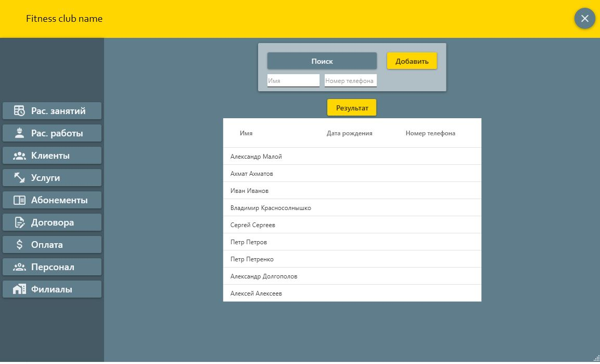
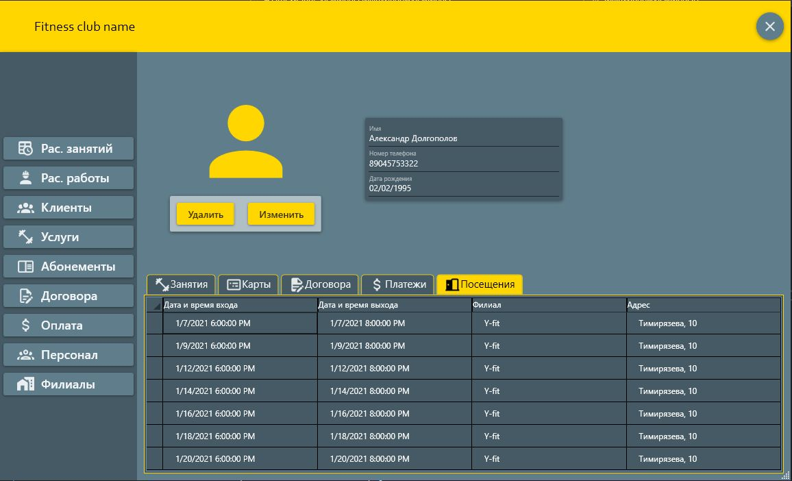

# 2-course-App
Десктопное приложение финтес-клуба. 

## Стек технологий
- C#
- WPF
- Entity Framework
- MaterialDesign
## Архитектура
- MVVM

## Перечень работ и краткое их описание

- 1 Лаб. работа - Техническое задание
- 2 Лаб. работа - UML Диаграммы прецедентов и классов
- 3 Лаб. работа - Схема реляционный базы данных
- 4 Лаб. работа - Интерфейс программной системы
- 5 Лаб. работа - UML Диаграммы действия, последовательности, состояния
- 6 Лаб. работа - API системы и UML диаграмма размещения
- 7 Лаб. работа - Документация на API

## Скриншоты

